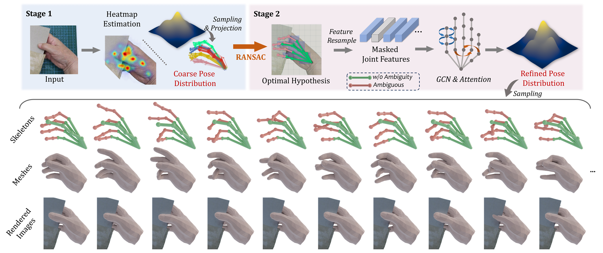

This repository provides the code implementation for the paper "A Coarse-to-Fine Multi-Hypothesis Method for Ambiguous Hand Pose Estimation, TIP'2025".



The experiments is performed on DexYCB, HO3Dv3, and ARCTIC datasets, as well as the 3DOH50K human body dataset. This open-source implementation includes training and validation scripts, along with pretrained weights for hand pose estimation. For human body pose estimation, users can train the relevant components (./main) using the provided code.

#### 1. Running Evaluation

Before validation, please run the 'rearange.py' script for each dataset in the ./data directory to generate annotation files with standardized interfaces. For the HO3Dv3_MHE dataset, the necessary annotations are provided and can be downloaded to view the evaluation results of the multi-solution distribution on this dataset. [Custom HO3D_MHE Annotation](https://drive.google.com/file/d/1__y1_GCdvpspu8-KVSBoRIjtuD5yvqJe/view?usp=drive_link)

The pretrained network weights can be downloaded here. [checkpoints](https://drive.google.com/file/d/1zHgB8Sx4uhUXRK-2AlpOVLpw--IqJmDZ/view?usp=drive_link)

The file structure is shown below; please place all files in the checkpoints directory. Evaluation results for some weights may differ slightly from those reported in the paper due to subsequent adjustments in training strategies. However, these numerical differences remain within an acceptable range.

```
| checkpoints
|---- MHEntropy_datas # the visibility label produced in "MHEntropy, ICCV'2023"
|-------- Ho3dv3_MHE_Jvis.pkl
|---- pretrained_resnet # pretrained backbone
|-------- resnet50-0676ba61.pth
|---- processed_mano # the lbs weights of manolayer
|-------- MANO_LEFT.pkl
|-------- MANO_RIGHT.pkl
|---- snapshots # the network weights of ours
|-------- ARCTIC_P1_JPE_15.04_wo_multiHypo.pkl
|-------- ARCTIC_P2_JPE_16.67_wo_multiHypo.pkl
|-------- DexYCB_JPE_11.68_wo_multiHypo.pkl
|-------- DexYCB_JPE_12.15_RD_0.56.pkl
|-------- HO3Dv3_PAJPE_8.3_wo_multiHypo.pkl
|-------- HO3Dv3MHE_RD_0.21.pkl
```

##### 1.1 ARCTIC Dataset Evaluation

```
python scripts/eval_Arctic_accuracy.py
```

You can view the evaluation results for various protocols by adjusting the protocol number and the corresponding weights in this script.

##### 1.2 DexYCB Dataset Evaluation

```
python scripts/eval_DexYCB_accuracy.py
```

You can view the results with or without multi-hypothesis annotations (multiHypo) by adjusting the corresponding weights in this script.

##### 1.3 HO3Dv3 Dataset Evaluation

```
python scripts/eval_HO3Dv3_accuracy.py
```

The prediction results for the HO3Dv3 dataset should be uploaded to the official leaderboard for evaluation. (During our experiments and prior to submitting our paper, the ground truth for the HO3D dataset was not publicly available; now, however, the official ground truth can be directly accessed and used)

##### 1.4 HO3Dv3_MHE Dataset Evaluation

```
python scripts/eval_HO3Dv3Mhe_Distribution.py
```

HO3Dv3_MHE is based on the "MHEntropy, ICCV 2023" framework, which re-partitions the HO3Dv3 training set to evaluate the effectiveness of multi-hypothesis distribution prediction on HO3Dv3 data.

#### 2 Train

```
python .TrainLauncher.py
```

By modifying the configuration in .TrainLauncher.py, multi-process training can be initiated for various stages and datasets.

#### 3. Multi-Hypothesis Annotation Augmentation

The ./data/MultiAnnoAugment directory contains the "multi-hypothesis annotation augmentation" code for the ARCTIC dataset. The overall workflow closely follows the methodology described in the paper, with minor modifications to account for occlusion relationships between hands specific to ARCTIC.

#### 4. Visualization

The file DrawHand_Blender.py contains several methods for generating hand scenes in Blender to achieve enhanced visualizations, as presented in our paper.

#### 5. References

1. MHEntropy: [MHEntropy_ICCV_2023](https://openaccess.thecvf.com/content/ICCV2023/html/Chen_MHEntropy_Entropy_Meets_Multiple_Hypotheses_for_Pose_and_Shape_Recovery_ICCV_2023_paper.html)
2. DexYCB: [NVlabs/dex-ycb-toolkit](https://github.com/NVlabs/dex-ycb-toolkit)
3. ARCTIC: [zc-alexfan/arctic](https://github.com/zc-alexfan/arctic)
4. HO3D: [shreyashampali/ho3d](https://github.com/shreyashampali/ho3d?)
5. nflows: [bayesiains/nflows](https://github.com/bayesiains/nflows)

